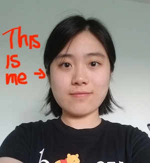

# **Yan Ji's Page**

> Watch your ***thoughts***; they become ***words***.   
Watch your ***words***; they become ***actions***.  
Watch your ***actions***; they become ***habits***.  
Watch your ***habits***; they become ***character***.  
Watch your ***character***; it becomes your ***destiny***.  
-- **Lao-Tze**



\
I'm from China and love Chinese food!! My name in Chinese is **冀燕**, which pronounces **Ji**(last) **Yan**(first). I also gave myself a really cool English name which is ***Avery***. It means [*elf ruler*](Avery.jpg.webp). I also in later text tell more about my [hobbies](#things-i-like-to-do-in-my-spare-time), other [professional areas](#other-professions-id-also-like-to-dive-in) I'd like to explore, some of my favorite [git commands](#my-favorite-git-commands), and what I've been [reading](#my-reading-process-for-2022) in 2022!!

#   
### **Things I like to do in my spare time:** 

- Reading my books!!   
- Hiking with friends!!  
- Acupuncture :)  
- Watching interesting videos (...my current addiction is [this website](https://www.bilibili.com)) 
- ......  
  
#
### **Other professions I'd also like to dive in:**  

1. psychological therapist
2. acupuncturist
   
# 
### **My favorite git commands:**
```
git add  
git commit  
git push  
git status  
git branch  
git checkout  
```

#
### **My reading process for 2022:**  

- [x] The Human Condition -- *Hannah Arendt*
- [x] The Communist Manifesto -- *Karl Marx* and *Friedrich Engels*
- [ ] The Age of Surveillance Capitalism -- *Shoshana Zuboff*